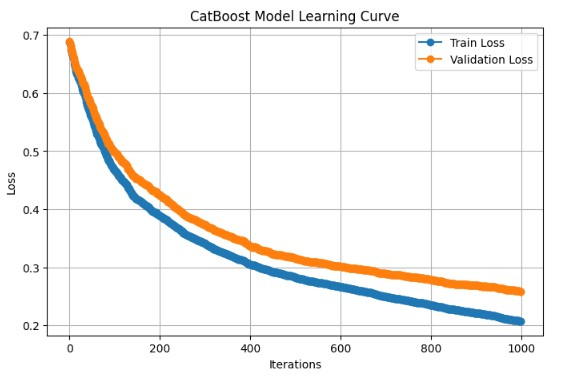
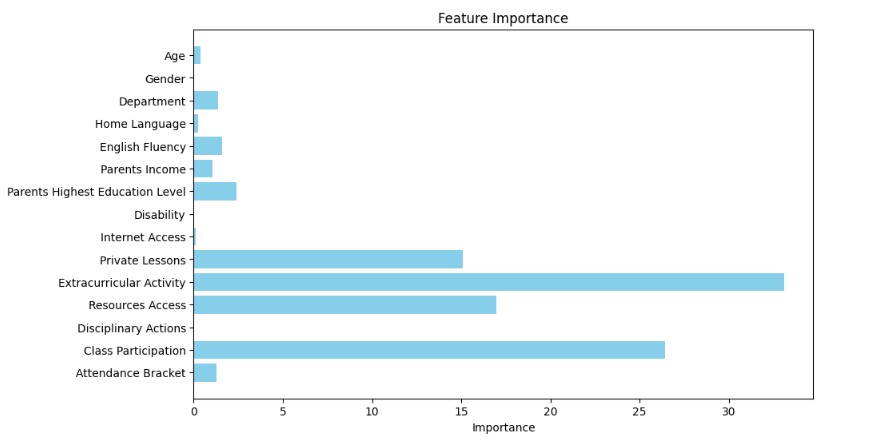
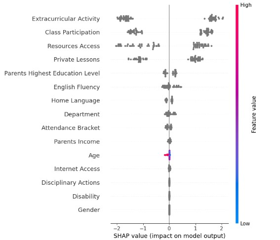

## Improving Students Performance in Nigerian Schools
This project focuses on using data analytics to improve student performance developing a comprehensive data pipeline, predictive models, and actionable insights.

### - Problem Definition
 
In many Nigerian schools, student performance in key examinations remains subpar, as seen in recent results where a significant percentage of students scored below average in the JAMB UTME. This project seeks to address the underlying causes of poor student performance by collecting and analyzing data on factors that influence academic success. Our goal is to use data to identify at-risk students and provide recommendations for interventions that can improve their exam outcomes.

### - Data Collection

Since many schools lack a data infrastructure and we could not get real data, we simulated all data used taking into account the realities of Nigerian schools.

Simulated Data Includes: 

1. Survey Data : This data has information on demographic, behavioral, Socio-economic, and social engagement data which allows us to capture non-academic factors influencing performance.
2. Assessment Data:  This data has details of student performance on each subject in their last internal exam.
3. student Data: It contains information of the students (name, number, address...)
4. Subjects Data: Information on the subjects taken in the school
5. Teachers Data: Teachers information.

### - Database Building
This pipeline is designed to manage student and school-related data, storing CSV files in AWS S3, and loading them into Snowflake for centralized management and analysis. The pipeline is orchestrated using Apache Airflow to automate the data ingestion process and ensure efficient handling of daily operations such as exam results, attendance, and performance tracking.

Data Sources

* CSV File Structure: The pipeline ingests data from CSV files containing student records, exam results, and other school-related data.
* Frequency: CSV files are generated daily/weekly.
* Naming Convention: Files are named using the pattern school_{date}.csv.
   
S3 Setup
*  S3 Bucket: school-db-bucket
* Folder Structure: Files are organized based on year and month for easier retrieval. Example: students/{year}/{month}/
*  Retention Policy: Files are retained for 1 year before they are archived or deleted based on school policies.

 Snowflake Setup
* Destination Table: Data from the CSV files will be loaded into its respective Snowflake table
  
Airflow Orchestration
*  Airflow DAG: The pipeline is orchestrated by an Airflow DAG which automates the process of data extraction, transformation, and loading (ETL).
   Tasks:
    * Extract Task: Fetch CSV files containing student data from the source.
    * Upload Task: Upload the CSV files to the designated S3 bucket.
    * Load Task: Load data from S3 to Snowflake using the COPY INTO command.
    *  Schedule: The pipeline is to be run at the end of each term
      
Monitoring and Logging
* Monitoring: The pipeline is monitored using Airflow's UI and logging system.
    *All task executions and failures are logged for troubleshooting.
* Alerting: Alerts are set up via email to notify the admin of any failures or delays in the pipeline.
* Data Quality Checks: Row count checks and validation rules are run before loading data into Snowflake to ensure integrity.

 Security and Permissions
AWS IAM Policy: Proper IAM policy isset to control access to the S3 bucket, ensuring that only authorized users and systems can read or write data.

### - Exploratory Data Analysis 

In the EDA phase, we explored relationships between different variables to uncover patterns, correlations, and key insights. By performing descriptive statistics and visualizations, we aimed to understand how various factors impact student performance.

Insights gotten from the analysis are : 
1. Students who partake actively in class have high performance than students who rarely participate in class activities
2. Students who take private lessons tend to perform better, on average, than those who do not
3. Higher levels of parental education do not necessarily lead to improved academic outcomes for their children.
4. Students without internet access perform better on average than those with internet access
5. Students who participated in extracurricular activities perform better academically, with a higher average score than those who don't.

### - Model Building 

The core of the project is developing a predictive model to forecast student success in upcoming exams. Based on the data collected, the CatBoost algorithm was chosen for this study due to its efficiency in handling categorical variables. With 14 out of 15 features in our dataset being categorical, CatBoost's native processing capability eliminated the need for additional preprocessing, avoiding the introduction of noise and redundant features from traditional encoding methods.

CatBoost’s ability to accurately manage categorical features made it the ideal model for our context. The model was trained on 225 samples using its robust gradient boosting technique, allowing us to focus on fine-tuning rather than extensive data transformation.

To optimize performance, we employed hyperparameter tuning using RandomizedSearchCV and Bayesian Optimization with Optuna. The latter method outperformed the former by efficiently selecting hyperparameters that enhanced model performance. The best parameters included a learning rate of clf_leaf, 1000 iterations, and the boosting type set to “Ordered.”

Features Used:

Academic performance metrics (test scores, continuous assessments).
Attendance rates and class participation.
Socio-economic factors (parental education, income levels, access to technology).
Student engagement in extracurricular activities.

The model is trained on 75% of the data and tested on 25% to evaluate its accuracy in predicting whether a student will pass or fail the exams.

### - Model Evaluation
The CatBoost model was evaluated on 75 validation samples, yielding strong performance metrics:

#### **Before Hyperparamter Tuning**
**Training Set:**

- Accuracy Score: 93%
- Precision Score: 91%
- Recall Score: 1.00%
- F1 Score: 95%
- AUC Score: 97%

**Validation Set:**

- Accuracy Score: 89%
- Precision Score: 86%
- Recall Score: 1.00%
- F1 Score: 93%
- AUC Score: 93%
These metrics indicate no overfitting, as validation scores closely matched training scores. Cross-validation score of 0.94 further confirmed the model's generalization ability.

The log-loss graph illustrated continuous loss reduction with increasing iterations, supporting the model's robustness. 

**Model Learning Curve**
 

**After hyperparameter tuning** with Bayesian Optimization, performance significantly improved: 

**Training Set:**

- Accuracy Score: 97%
- Precision Score: 95%
- Recall Score: 1.00%
- F1 Score: 98%
- AUC Score: 99%

**Validation Set:**

- Accuracy Score: 96%
- Precision Score: 94%
- Recall Score: 1.00%
- F1 Score: 97%
- AUC Score: 96%
These results highlight the effectiveness of Bayesian Optimization in enhancing model accuracy and robustness for our dataset.

### - Model Interpretation 
**Model interpretation** is crucial for helping educators understand why the model makes specific decisions, enabling them to focus their attention on key areas that influence student performance. The feature importance analysis revealed that extracurricular activities, private lessons, and active class participation were the most significant contributors to the model's predictions.

**Feature Importance**

To gain further insights, we used SHapley Additive exPlanations (SHAP), which demonstrated how each feature influenced individual predictions. SHAP provided transparency, showing educators which factors drive the model’s decisions, helping them make informed choices to support student improvement.

**Model Interpretation Using SHAP**

### - Model Deployment 
The model was deployed using Streamlit on Streamlit Cloud services, providing an interactive web application for real-time predictions. We created an interactive application that allows educators to input student data and receive predictions, enabling data-driven decisions to enhance student performance.

You can access the application [here](https://).

